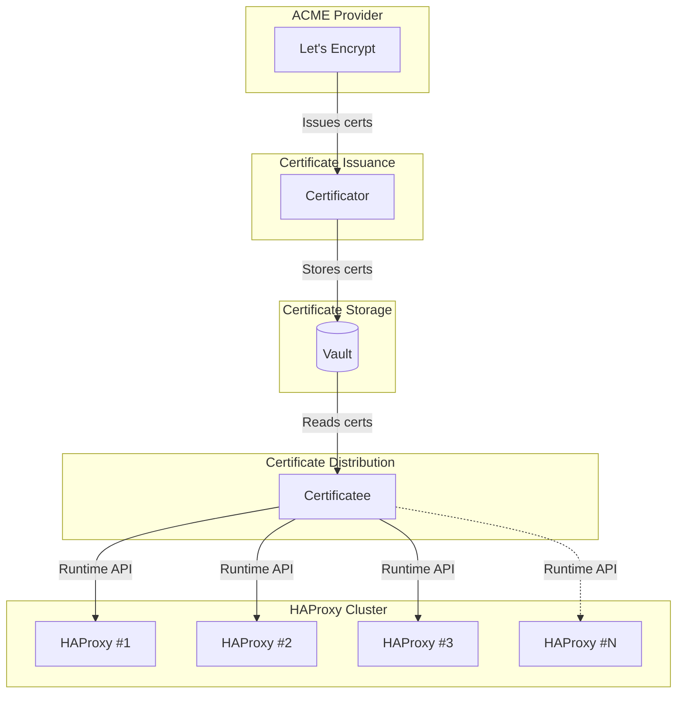

# Triton Certificator

This is a fork of [vinted's certificator](https://github.com/vinted/certificator) tool with customisations made to support our specific use-case, which has removed upstream features, which we have not (yet) attempted to upstream.

As such this repository has been stripped down, removing various upstream tests which are no longer valid. These can be reintroduced if they are fixed, but there's no value to keeping them while they are not.

We have also added a devcontainer and a workflow for building the application container ready for use in nomad.

## Components

### Certificator

The main certificate issuing tool that manages certificates through ACME (Let's Encrypt) and stores them in Vault.

### Certificatee

A tool that synchronizes certificates from Vault to HAProxy using the HAProxy Runtime API. It monitors certificates loaded in HAProxy and updates them when:
- The certificate is expiring within the configured threshold (default: 30 days)
- The certificate serial number differs from the one stored in Vault

## Configuration

### Certificatee Environment Variables

| Variable | Default | Description |
|----------|---------|-------------|
| `HAPROXY_ENDPOINTS` | (required) | Comma-separated list of HAProxy endpoints. Each can be a Unix socket path (starting with `/`) or TCP address (`host:port`). Example: `/var/run/haproxy1.sock,/var/run/haproxy2.sock,192.168.1.10:9999` |
| `CERTIFICATEE_UPDATE_INTERVAL` | `24h` | How often to check certificates for updates |
| `CERTIFICATEE_RENEW_BEFORE_DAYS` | `30` | Update certificates expiring within this many days |
| `VAULT_APPROLE_ROLE_ID` | (required) | Vault AppRole Role ID |
| `NOMAD_TOKEN` | (required) | Used as Vault AppRole Secret ID |
| `VAULT_KV_STORAGE_PATH` | `secret/data/certificator/` | Vault KV storage path for certificates |
| `METRICS_LISTEN_ADDRESS` | | Address for Prometheus metrics endpoint (e.g., `:9090`) |
| `METRICS_PUSH_URL` | | URL to push metrics on shutdown |
| `LOG_FORMAT` | `JSON` | Log format: `JSON` or `LOGFMT` |
| `LOG_LEVEL` | `INFO` | Log level: `DEBUG`, `INFO`, `WARN`, `ERROR` |
| `ENVIRONMENT` | `prod` | Environment name for metrics labels |

### Certificator Environment Variables

| Variable | Default | Description |
|----------|---------|-------------|
| `CERTIFICATOR_DOMAINS` | | Comma-separated list of domains to manage |
| `CERTIFICATOR_RENEW_BEFORE_DAYS` | `30` | Renew certificates expiring within this many days |
| `ACME_ACCOUNT_EMAIL` | | Email for ACME account |
| `ACME_DNS_CHALLENGE_PROVIDER` | | DNS challenge provider name |
| `ACME_DNS_PROPAGATION_REQUIREMENT` | `true` | Wait for DNS propagation |
| `ACME_SERVER_URL` | `https://acme-staging-v02.api.letsencrypt.org/directory` | ACME server URL |
| `EAB_KID` | | External Account Binding Key ID |
| `EAB_HMAC_KEY` | | External Account Binding HMAC Key |

## HAProxy Runtime API Integration

Certificatee uses the HAProxy Runtime API to update certificates at runtime without restarting HAProxy. It supports:

- **Multiple endpoints**: Configure multiple HAProxy instances to update simultaneously
- **Unix sockets and TCP**: Connect via Unix sockets (e.g., `/var/run/haproxy.sock`) or TCP (e.g., `127.0.0.1:9999`)
- **Automatic retries**: Connections are retried with exponential backoff (default: 3 retries, 1-30s delays)
- **Graceful degradation**: If one HAProxy instance is unreachable, the tool continues updating reachable instances
- **Runtime updates**: Certificates are updated using `set ssl cert` and `commit ssl cert` commands

### HAProxy Configuration

Enable the Runtime API in HAProxy:

```haproxy
global
    stats socket /var/run/haproxy.sock mode 660 level admin expose-fd listeners
    # Or for TCP access:
    stats socket ipv4@127.0.0.1:9999 level admin
```

Certificate files must be named after the domain (e.g., `/etc/haproxy/certs/example.com.pem`).

## Metrics

Certificatee exposes Prometheus metrics for monitoring:

### General Metrics

| Metric | Type | Labels | Description |
|--------|------|--------|-------------|
| `up` | Gauge | service, version, hostname, environment | Indicates if the service is running (1=up, 0=down) |
| `certificatee_certificates_updated_on_disk_total` | Gauge | domain | Certificates updated successfully |
| `certificatee_certificates_update_failures_total` | Counter | domain | Certificate update failures |

### HAProxy-Specific Metrics

| Metric | Type | Labels | Description |
|--------|------|--------|-------------|
| `certificatee_haproxy_endpoint_up` | Gauge | endpoint | HAProxy endpoint reachability (1=up, 0=down) |
| `certificatee_haproxy_connections_total` | Counter | endpoint, status | Total connection attempts (status: success/failure) |
| `certificatee_haproxy_connection_retries_total` | Counter | endpoint | Connection retry attempts |
| `certificatee_haproxy_certificates_checked_total` | Counter | endpoint | Certificates checked per endpoint |
| `certificatee_haproxy_certificates_updated_total` | Counter | endpoint, domain | Certificates updated per endpoint/domain |
| `certificatee_haproxy_last_check_timestamp_seconds` | Gauge | endpoint | Unix timestamp of last successful check |
| `certificatee_haproxy_command_duration_seconds` | Histogram | endpoint, command | Duration of HAProxy Runtime API commands |

Not an exhaustive list; refer to the source code for all metrics.

## Development

### Using devenv

The project includes a `devenv.nix` for development.
You can also just go build stuff.

### Running Tests

```bash
go test ./...
```

### Building

```bash
go build ./cmd/certificatee
go build ./cmd/certificator
```

## Architecture



## License

See the original [vinted/certificator](https://github.com/vinted/certificator) repository for license information.
