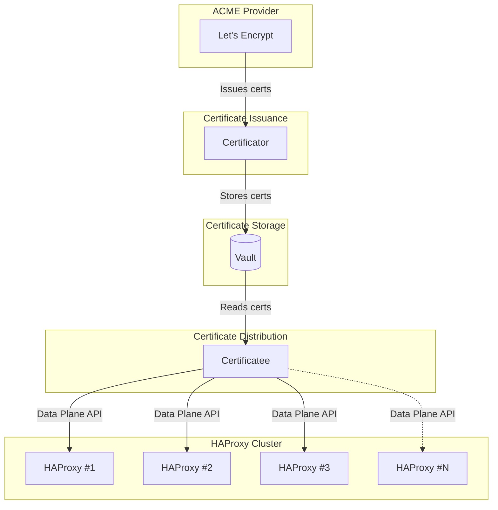

# Triton Certificator

This is a fork of [vinted's certificator](https://github.com/vinted/certificator) tool with customisations made to support our specific use-case, which has removed upstream features, which we have not (yet) attempted to upstream.

As such this repository has been stripped down, removing various upstream tests which are no longer valid. These can be reintroduced if they are fixed, but there's no value to keeping them while they are not.

## Components

### Certificator

The main certificate issuing tool that manages certificates through ACME (Let's Encrypt) and stores them in Vault.

### Certificatee

A daemon that synchronizes certificates from Vault to HAProxy using the HAProxy Data Plane API. It monitors certificates loaded in HAProxy and updates them when:
- The certificate is expiring within the configured threshold (default: 30 days)
- The certificate serial number differs from the one stored in Vault

`certificatee` requires HAProxy Data Plane API v3. It reads expiry and serial metadata from HAProxy's live runtime certificate state and uses Vault only as the source for replacement certificate payloads. Replacement certificates are written to HAProxy storage with `skip_reload=true`, then written to HAProxy runtime so updates both survive future reloads and take effect immediately.

## Configuration

### Certificatee Environment Variables

| Variable | Default | Description |
|----------|---------|-------------|
| `HAPROXY_DATAPLANE_API_URLS` | (required) | Comma-separated list of HAProxy Data Plane API URLs. Example: `http://haproxy1:5555,http://haproxy2:5555` |
| `HAPROXY_DATAPLANE_API_USER` | (required) | Username for HAProxy Data Plane API authentication |
| `HAPROXY_DATAPLANE_API_PASSWORD` | (required) | Password for HAProxy Data Plane API authentication |
| `HAPROXY_DATAPLANE_API_INSECURE` | `false` | Skip TLS certificate verification for HTTPS connections |
| `CERTIFICATEE_UPDATE_INTERVAL` | `24h` | How often to check certificates for updates |
| `CERTIFICATEE_RENEW_BEFORE_DAYS` | `30` | Update certificates expiring within this many days |
| `VAULT_APPROLE_ROLE_ID` | (required) | Vault AppRole Role ID |
| `NOMAD_TOKEN` | (required) | Used as Vault AppRole Secret ID |
| `VAULT_KV_STORAGE_PATH` | `secret/data/certificator/` | Vault KV storage path for certificates |
| `METRICS_LISTEN_ADDRESS` | | Address for Prometheus metrics endpoint (e.g., `:9090`) |
| `METRICS_PUSH_URL` | | URL to push metrics on shutdown |
| `LOG_FORMAT` | `JSON` | Log format: `JSON` or `LOGFMT` |
| `LOG_LEVEL` | `INFO` | Log level: `DEBUG`, `INFO`, `WARN`, `ERROR` |
| `ENVIRONMENT` | `prod` | Environment name for metrics labels |

### Certificator Environment Variables

| Variable | Default | Description |
|----------|---------|-------------|
| `CERTIFICATOR_DOMAINS` | | Comma-separated list of domains to manage |
| `CERTIFICATOR_RENEW_BEFORE_DAYS` | `30` | Renew certificates expiring within this many days |
| `ACME_ACCOUNT_EMAIL` | | Email for ACME account |
| `ACME_DNS_CHALLENGE_PROVIDER` | | DNS challenge provider name |
| `ACME_DNS_PROPAGATION_REQUIREMENT` | `true` | Wait for DNS propagation |
| `ACME_SERVER_URL` | `https://acme-staging-v02.api.letsencrypt.org/directory` | ACME server URL |
| `EAB_KID` | | External Account Binding Key ID |
| `EAB_HMAC_KEY` | | External Account Binding HMAC Key |

## HAProxy Data Plane API Integration

Certificatee uses the HAProxy Data Plane API to update certificates at runtime without restarting HAProxy. It supports:

- **Multiple endpoints**: Configure multiple HAProxy instances to update simultaneously
- **HTTPS with optional TLS verification**: Connect securely with configurable certificate verification
- **Basic authentication**: Authenticate using username/password credentials
- **Automatic retries**: Connections are retried with exponential backoff (default: 3 retries, 1-30s delays)
- **Graceful degradation**: If one HAProxy instance is unreachable, the tool continues updating reachable instances
- **REST API**: Certificates are persisted via the HAProxy Data Plane API v3 `/v3/services/haproxy/storage/ssl_certificates` endpoints and activated via `/v3/services/haproxy/runtime/ssl_certs`
- **Live certificate state**: Expiry checks use HAProxy's currently loaded certificate metadata, not Vault certificate expiry

### HAProxy Data Plane API Configuration

The HAProxy Data Plane API must be installed and configured separately. See the [HAProxy Data Plane API documentation](https://www.haproxy.com/documentation/dataplaneapi/latest/) for installation instructions.

Example Data Plane API configuration (`dataplaneapi.yaml`):

```yaml
dataplaneapi:
  host: 0.0.0.0
  port: 5555
  user:
    - name: admin
      password: your-secure-password
      insecure: false
  haproxy:
    config_file: /etc/haproxy/haproxy.cfg
    haproxy_bin: /usr/sbin/haproxy
```

Certificate files must be named after the domain (e.g., `/etc/haproxy/certs/example.com.pem`).

## Metrics

Certificator and certificatee expose Prometheus metrics for monitoring:

- `GET /metrics` exposes Prometheus metrics when `METRICS_LISTEN_ADDRESS` is set.
- `GET /health` returns `200 OK` when the process health check passes. For certificatee, health requires Vault reachability and at least one recent successful HAProxy Data Plane API v3 runtime certificate sync probe. Non-v3 endpoints are skipped and reported via metrics and logs.

### Shared Metrics

| Metric | Type | Labels | Description |
|--------|------|--------|-------------|
| `up` | Gauge | `service`, `version`, `hostname`, `environment` | Indicates if the service is running (`1` = up, `0` = down) |

### Certificator Metrics

| Metric | Type | Labels | Description |
|--------|------|--------|-------------|
| `certificator_certificates_renewed_total` | Counter | `domain` | Certificates renewed successfully |
| `certificator_certificates_renewal_failures_total` | Counter | `domain` | Certificate renewal failures |
| `certificator_certificates_checked_total` | Counter | `domain`, `status` | Certificate checks by result status |

### Certificatee Metrics

| Metric | Type | Labels | Description |
|--------|------|--------|-------------|
| `certificatee_certificates_updated_total` | Counter | `endpoint`, `domain` | Certificates updated successfully in HAProxy |
| `certificatee_certificates_update_failures_total` | Counter | `endpoint`, `domain` | Certificate update failures |
| `certificatee_certificates_expiring` | Gauge | `endpoint` | Number of certificates expiring within the renewal threshold |
| `certificatee_certificates_total` | Gauge | `endpoint` | Total number of certificates managed per endpoint |
| `certificatee_certificates_wildcard_total` | Gauge | `endpoint` | Number of certificates with wildcard storage filenames |
| `certificatee_certificate_not_after_timestamp_seconds` | Gauge | `endpoint`, `domain` | Live certificate expiry reported by the HAProxy Data Plane API runtime endpoint |
| `certificatee_certificate_metadata_lookup_failures_total` | Counter | `endpoint`, `domain` | Per-certificate Data Plane API runtime metadata lookups that failed |
| `certificatee_dataplaneapi_version` | Gauge | `endpoint`, `version` | Detected HAProxy Data Plane API version for certificatee endpoints (`1` = detected version) |
| `certificatee_last_sync_timestamp_seconds` | Gauge | `endpoint` | Unix timestamp of the last successful endpoint sync |

## Development

### Using Nix

The project includes a `flake.nix` for development. Enter the development shell with:

```bash
nix develop
```

Or use [direnv](https://direnv.net/) for automatic shell activation.

### Running Tests

```bash
go test ./...
```

### Release Builds

Release binaries are built by [`rpcpool/Binaries-ci`](https://github.com/rpcpool/Binaries-ci). The tag workflow in this repository dispatches `build-release.yml` in Binaries-ci; this repository does not build release artifacts directly.

## Architecture


```mermaid
flowchart TB
    subgraph ACME["ACME Provider"]
        LE[Let's Encrypt]
    end

    subgraph Storage["Certificate Storage"]
        Vault[(Vault)]
    end

    subgraph Issuance["Certificate Issuance"]
        Certificator[Certificator]
    end

    subgraph Distribution["Certificate Distribution"]
        Certificatee[Certificatee]
    end

    subgraph HAProxyCluster["HAProxy Cluster"]
        HAProxy1[HAProxy #1]
        HAProxy2[HAProxy #2]
        HAProxy3[HAProxy #3]
        HAProxyN[HAProxy #N]
    end

    LE -->|Issues certs| Certificator
    Certificator -->|Stores certs| Vault
    Vault -->|Reads certs| Certificatee
    Certificatee -->|Data Plane API| HAProxy1
    Certificatee -->|Data Plane API| HAProxy2
    Certificatee -->|Data Plane API| HAProxy3
    Certificatee -.->|Data Plane API| HAProxyN
```

## License

See the original [vinted/certificator](https://github.com/vinted/certificator) repository for license information.
